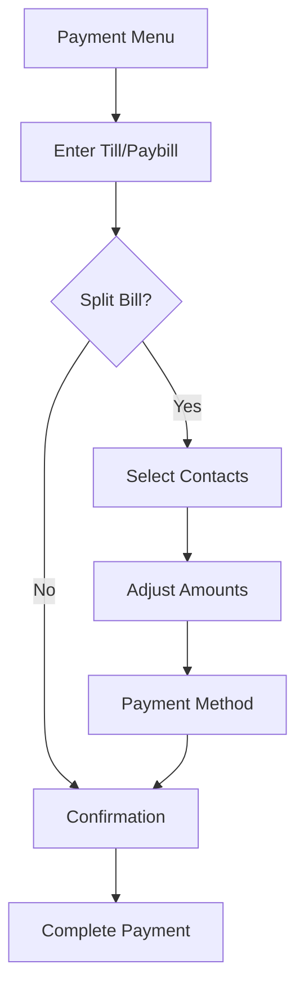

# M-Pesa Bill Splitter Application - README

## Overview
This M-Pesa Bill Splitter is an in-app feature that allows users to easily split bills with friends and family using Kenya's popular M-Pesa mobile payment system. The application provides a seamless, step-by-step process for dividing expenses and initiating group payments directly within the M-Pesa ecosystem.


https://github.com/user-attachments/assets/d93341d7-8d56-409c-b8a4-966110aeb491


## Installation with Expo

This project is built with React Native using the Expo framework. Follow these steps to get started:

### Prerequisites
- Node.js (v16 or later recommended)
- Expo CLI
- Expo Go app on your iOS/Android device

### Installation Steps
1. **Install Expo CLI globally**
   ```bash
   npm install -g expo-cli
   ```

2. **Clone the repository**
   ```bash
   git clone https://github.com/ayuboketch/msplit.git
   cd msplit
   ```

3. **Install dependencies**
   ```bash
   npm install
   # or
   yarn install
   ```

4. **Start the development server**
   ```bash
   expo start
   # or
   npx expo start
   ```

5. **Run on your device**
   - Scan the QR code with the Expo Go app (Android) or Camera app (iOS)
   - Press `i` for iOS simulator or `a` for Android emulator

### Dependencies
```json
"dependencies": {
  "expo": "~49.0.0",
  "react": "18.2.0",
  "react-native": "0.72.0",
  "@expo/vector-icons": "^14.0.0"
}
```

## Key Features
- 🧾 **Multi-step payment workflow** with intuitive navigation
- 👥 **Contact-based bill splitting** with customizable amounts
- ⚖️ **Two payment methods**: 
  - Consolidated payment (friends pay you, you pay business)
  - Direct payment (each person pays business directly)
- 💰 **Real-time amount adjustment** for fair expense sharing
- 🔒 **Secure confirmation process** before transaction
- 📱 **Mobile-optimized UI** with dark theme design

## How It Works

### Payment Flow


### Step-by-Step Process
1. **Payment Type Selection**: Choose between Pay Bill, Buy Goods, or other options
2. **Business Details**: Enter till/paybill number and total amount
3. **Split Decision**: Choose to pay alone or split with others
4. **Contact Selection**: Pick contacts to split the bill with
5. **Amount Adjustment**: Customize payment amounts per participant
6. **Payment Method**: Select consolidated or direct payment
7. **Confirmation**: Review details and confirm payment

## Integration Guide

### 1. Import the component
```javascript
import { PaymentMenu } from './components/PaymentMenu';
```

### 2. Implement in your app
```javascript
function App() {
  const [paymentVisible, setPaymentVisible] = useState(false);

  return (
    <View>
      {/* Your existing app content */}
      <Button 
        title="Split Payment" 
        onPress={() => setPaymentVisible(true)} 
      />
      
      <PaymentMenu 
        visible={paymentVisible} 
        onClose={() => setPaymentVisible(false)} 
      />
    </View>
  );
}
```

### 3. Customization Options
- **Theme**: Modify colors in the stylesheet
- **Contact List**: Replace sample contacts with real data
- **Payment Integration**: Connect to M-Pesa API in `handleFinalConfirmation`
- **Additional Features**: Add tip calculation or currency conversion

## Development Notes

### Testing the Bill Splitter
1. Start the Expo development server
2. Open the app on your device/simulator
3. Trigger the PaymentMenu component
4. Use sample data for testing:
   - Till Number: `123456`
   - Amount: `5000`
   - Sample contacts included

### Expo-Specific Features
- **Vector Icons**: Uses `@expo/vector-icons` which works out-of-the-box
- **Safe Area Handling**: Built-in support for device notches
- **Over-the-Air Updates**: Push updates directly to users
- **Config Plugins**: Easy configuration for native features

## Future Enhancements
- 🚀 M-Pesa API integration for real transactions
- 📊 Expense tracking and history
- 🔗 Deep linking for payment requests
- 🌐 Multi-currency support
- 📸 QR code scanning for business details

## License
This project is licensed under the MIT License - see the [LICENSE.md](LICENSE.md) file for details.

---

**Important**: This implementation currently uses simulated data. For production use:
1. Integrate with the official [M-Pesa API](https://developer.safaricom.co.ke/)
2. Implement proper authentication and encryption
3. Follow Safaricom's security guidelines for financial transactions
4. Test thoroughly with sandbox credentials before going live

For Expo-specific documentation, refer to:
- [Expo Vector Icons](https://docs.expo.dev/guides/icons/)
- [Expo SDK Documentation](https://docs.expo.dev/versions/latest/)
- [Expo Payment Modules](https://docs.expo.dev/versions/latest/sdk/payments/)
